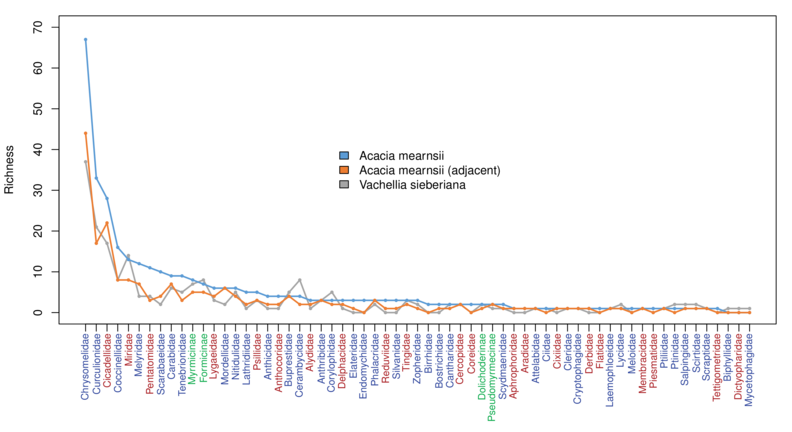
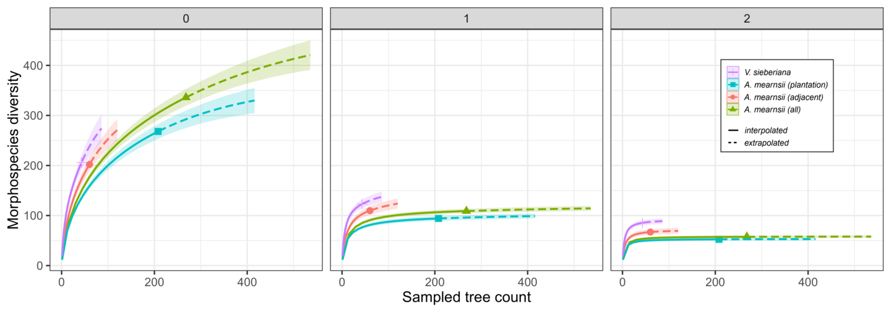

# Current version of figures

Note: pdf links are only (shift) clickable in the .Rmd file (not in the html).

## Figure 1

Figure 1. Morphospecies diversity by family by host tree category (plus all categories pooled). Acacia mearnsii includes all black wattle trees and Acacia mearnsii (adjacent) includes only the sites where Vachellia sieberiana co-occurs. Families are ordered on the X-axis by morphospecies richness in A. mearnsii. Sampling effort differs among the groups (A. mearnsii = 265 trees, A. mearnsii adjacent = 57 trees and V. sieberiana = 46 trees). Blue labels on the x-axis correspond to Order Coleoptera, red to Homoptera, and green to subfamilies within the ants (Hymenoptera: Formicidae).

### Pdf link (highlight and Alt-E)

C:/Users/jrg1035/Box Sync/Students_postdocsFABI/Sarai/MearnsiiCh3/Acacia data/graphs/BW_VS_Adj Morphospecies by family host.pdf

***

## Figure 2

*Figure 2. Sample-based rarefactions and extrapolations of insects collected from Vachellia sieberiana and Acacia mearnsii. q = 0 corresponds to species richness, q = 1 to the exponential of Shannon diversity and q = 2 to Inverse Simpson diversity (Chao et al., 2015). 95% confidence intervals were calculated by a bootstrap method based on 10,000 iterations. Solid and dashed portions of curves correspond to interpolated and extrapolated richness respectively.*

### Pdf link (highlight and Alt-E)

C:/Users/jrg1035/Box Sync/Students_postdocsFABI/Sarai/MearnsiiCh3/Acacia data/graphs/BW_VS Rarefaction By Host_all four.pdf

(./graphs/BW_VS Rarefaction By Host_all four.pdf)  

