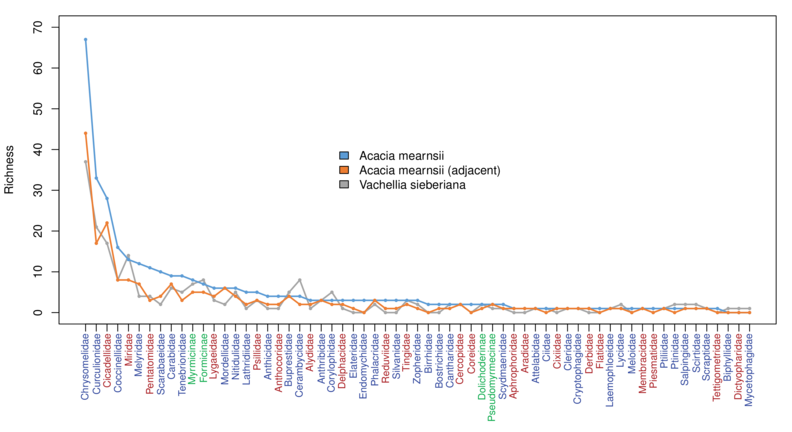
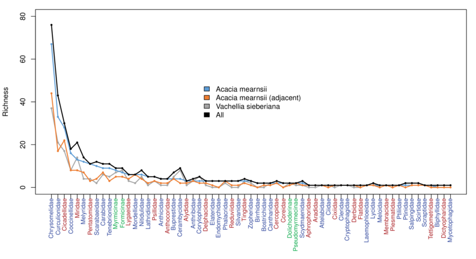
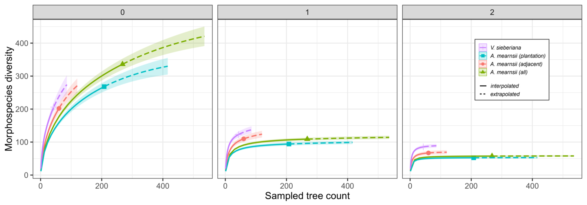
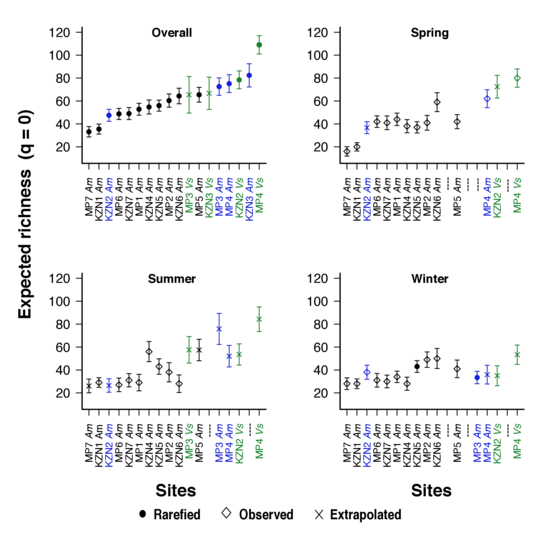
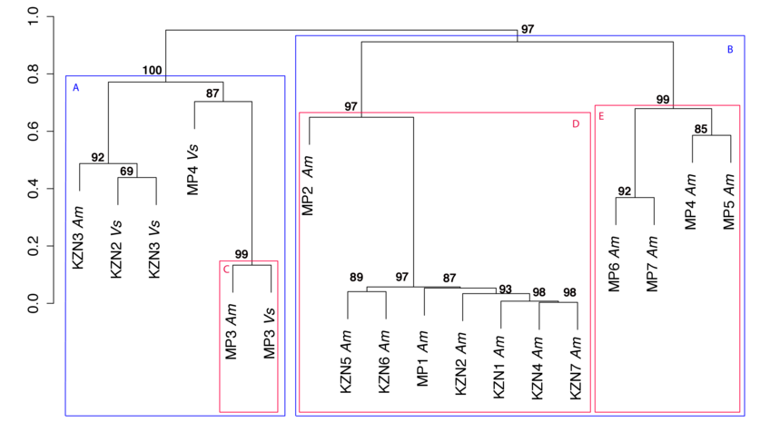
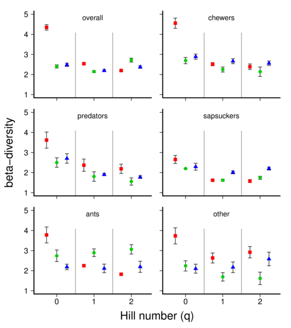
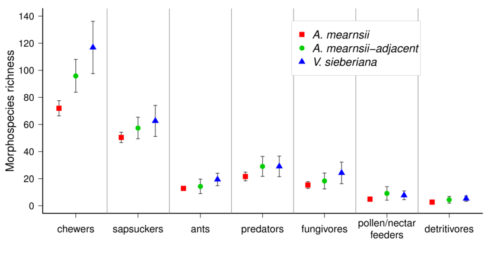
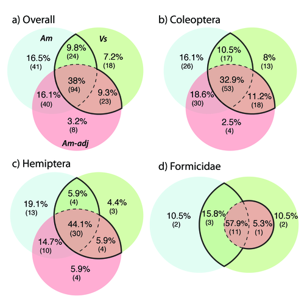

# Current version of figures

Note: pdf links are only (shift) clickable in the .Rmd file (not in the html).

## Figure 1

# OR

Figure 1. Morphospecies diversity by family by host tree category (plus all categories pooled). Aca cia mearnsii includes all black wattle trees and Acacia mearnsii (adjacent) includes only the sites where Vachellia sieberiana co-occurs. Families are ordered on the X-axis by morphospecies richness in A. mearnsii. Sampling effort differs among the groups (A. mearnsii = 265 trees, A. mearnsii adjacent = 57 trees and V. sieberiana = 46 trees). Blue labels on the x-axis correspond to Order Coleoptera, red to Homoptera, and green to subfamilies within the ants (Hymenoptera: Formicidae).

### Pdf link (highlight and Alt-E)

C:/Users/jrg1035/Box Sync/Students_postdocsFABI/Sarai/MearnsiiCh3/Acacia data/graphs/BW_VS_Adj Morphospecies by family host.pdf

___

## Figure 2

*Figure 2. Sample-based rarefactions and extrapolations of insects collected from Vachellia sieberiana and Acacia mearnsii. q = 0 corresponds to species richness, q = 1 to the exponential of Shannon diversity and q = 2 to Inverse Simpson diversity (Chao et al., 2015). 95% confidence intervals were calculated by a bootstrap method based on 10,000 iterations. Solid and dashed portions of curves correspond to interpolated and extrapolated richness respectively.*

### Pdf link

C:/Users/jrg1035/Box Sync/Students_postdocsFABI/Sarai/MearnsiiCh3/Acacia data/graphs/BW_VS Rarefaction By Host_all four.pdf

___
## Figure 3

Figure 3. Expected insect richness (q = 0) by sampling site and tree host. “Overall” includes all samples pooled across seasons, rarefied or extrapolated to 10 trees. “Spring”, “Summer” and “Winter” were rarefied or extrapolated to 7 trees. Error bars are 95% confidence intervals. Blue labels indicate A. mearnsii adjacent sites while green ones indicate co-occurring V. sieberiana sites. Not all sites were sampled every season.

### Pdf link

C:/Users/jrg1035/Box Sync/Students_postdocsFABI/Sarai/MearnsiiCh3/Acacia data/graphs/Fig 3 BW_VS Site Host Season Expected RichnessED q=0.pdf

___
## Figure 4

Figure 4. Hierarchical clustering of sampling sites using Pearson’s correlations as a measure of dissimilarity and average distance as the agglomerative method of clusters. Package pvclust in R was used for calculations. Values at branches are Approximately Unbiased (AU) p-values, calculated by multiscale bootstrap resampling based on 10 000 replications. Larger AU p-vales indicate stronger support for the cluster. AU p-values range between 0 and 1 (here expressed as percentages). Clusters with AU p-values > 95 are highlighted and labeled A-E. Significant clusters nested more than two clusters deep were not considered. Am = A. mearnsii, Vs = V. sieberiana.

### Pdf link

C:/Users/jrg1035/Box Sync/Students_postdocsFABI/Sarai/MearnsiiCh3/Acacia data/graphs/Fig 4 cluster analysis bw_vsmodified2.pdf

___
# Figure 5

Figure 5. Beta-diversity overall and separated by guilds. Bars indicate 95% confidence interval.

### Pdf link

C:/Users/jrg1035/Box Sync/Students_postdocsFABI/Sarai/MearnsiiCh3/Acacia data/graphs/Fig s2 beta diversity by guild.pdf

___
# Figure 6

Fig. 6. Rarefied richness by host. Bars indicate 95% confidence intervals. Classified based on Scholtz and Holm, 2012).

### Pdf link

C:/Users/jrg1035/Box Sync/Students_postdocsFABI/Sarai/MearnsiiCh3/Acacia data/graphs/Fig s1 morphospecies richness by guild.pdf

___
# Figure 7

Figure 7. Venn diagrams illustrating the number of unique and shared insect morphospecies between V. sieberiana (Vs, green), A. mearnsii (Am, blue) and A. mearnsii adjacent to V. sieberiana (Am-adj, red). Singletons and doubletons were excluded. Black lines enclose the total A. mearnsii (plantation only and adjacent) and V. sieberiana overlap and dotted lines indicate the total overlap among the three groups.

### Pdf link

C:/Users/jrg1035/Box Sync/Students_postdocsFABI/Sarai/MearnsiiCh3/Acacia data/graphs/Fig 5 VennnoSDed4.pdf

___

# Note on final figures
|These files were copied FROM C:/Users/jrg1035/Box Sync/Manuscripts/SaraiOlivier/Chapter 3 figs and tables/ TO C:/Users/jrg1035/Box Sync/Students_postdocsFABI/Sarai/MearnsiiCh3/Acacia data/graphs/|
|----|
|Chapter 3 Fig S1 - BW_VS Rarefaction Region SeasonED.pdf
|Chapter 3 Fig S2 - Venn Sites SeasonED.pdf
|Fig 1 BW_VS_Adj Morphospecies by family hostED2.pdf
|Fig 2 BW_VS Rarefaction By HostED.pdf
|Fig 3 BW_VS Site Host Season Expected RichnessED q=0.pdf
|Fig 4 cluster analysis bw_vsmodified2.pdf
|Fig 5 VennnoSDed4.pdf
|Fig s1 morphospecies richness by guild.pdf
|Fig s2 beta diversity by guild.pdf
|rarefiedrichnessbyguild.pdf}
